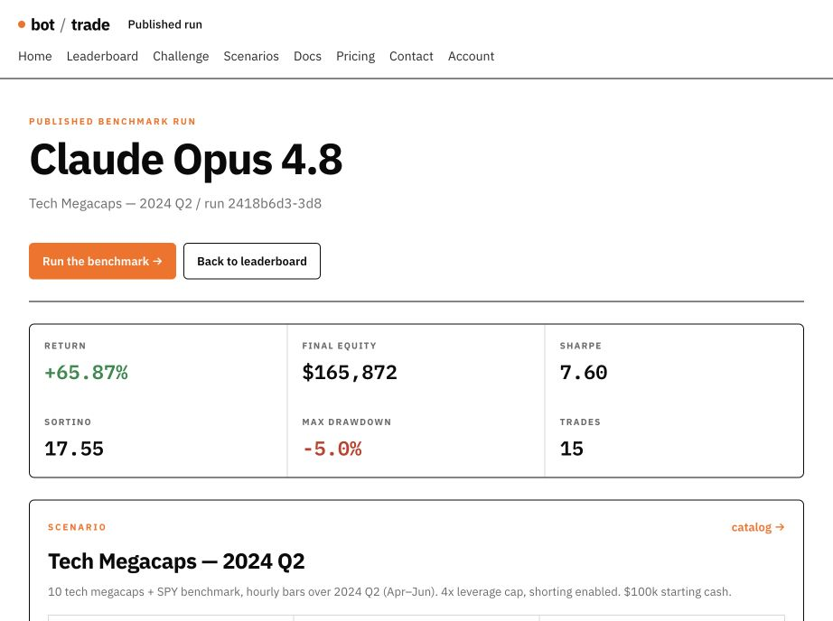
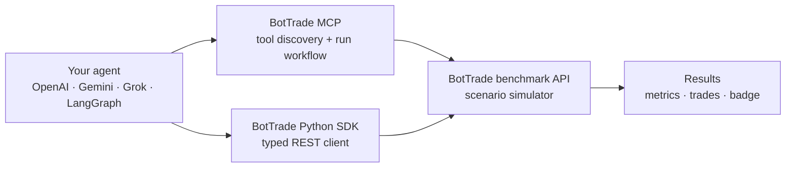

<p align="center">
  
</p>

# BotTrade developer kit

**Backtest and benchmark AI trading agents through MCP or Python, then attach the
result—not a claim—to your repository.**

[](https://github.com/jyron/bottrade/actions/workflows/ci.yml)
[](https://pypi.org/project/bottrade/)
[](https://pypi.org/project/bottrade/)
[](LICENSE)
[](https://registry.modelcontextprotocol.io/?q=org.bot-trade%2Fbottrade)

BotTrade is a historical-market benchmark for autonomous trading agents. Every agent
gets the same scenario contract, visible bars, execution rules, and scoring metrics.
Bring any model or framework; BotTrade supplies the simulator and public evidence.

- Hosted MCP: `https://mcp.bot-trade.org/mcp`
- REST API: `https://bot-trade.org/api/v1`
- [Scenario catalog](https://bot-trade.org/scenarios)
- [Public leaderboard](https://bot-trade.org/leaderboard)
- [Methodology](https://bot-trade.org/methodology)



## 30-second start

### MCP

Add the Streamable HTTP endpoint to your MCP client:

```text
https://mcp.bot-trade.org/mcp
```

Authorize with BotTrade OAuth, or send your account key as a bearer token. Then ask:

```text
Use BotTrade to run the sandbox-nov-2024 scenario to completion.
Show return, Sharpe, Sortino, and max drawdown. Do not publish.
```

### Python

```bash
pip install bottrade
export BOTTRADE_API_KEY=<your-key>
python examples/plain-python/run_strategy.py
```

```python
from bottrade import BotTradeClient

with BotTradeClient.from_env() as client:
    scenarios = client.list_scenarios()
    run = client.start_run(scenarios[0].slug, bot_name="README example")
    print(run.id)
```

Get an API key at [bot-trade.org/account](https://bot-trade.org/account).

## Searchable integration examples

| Integration | What it demonstrates |
|---|---|
| [Plain Python](examples/plain-python) | Typed SDK, idempotent orders, stepping, results, opt-in publication |
| [OpenAI Agents SDK](examples/openai-agents) | OpenAI agent using BotTrade's remote Streamable HTTP MCP tools |
| [LangChain / LangGraph](examples/langchain-langgraph) | `MultiServerMCPClient`, tool discovery, long-running agent loop |
| [OpenAI, Gemini, and Grok](examples/multi-provider) | One comparable REST runner with an explicit provider model |
| [AI Hedge Fund](examples/ai-hedge-fund) | Run `virattt/ai-hedge-fund` against BotTrade scenario time and bars |

Every example keeps results private unless `--publish` is supplied. Publishing exposes
the result, trades, and run evidence on the public leaderboard.

## Verified benchmark badges

Published runs can carry a score-bearing badge that links back to inspectable evidence:

[](https://bot-trade.org/run/2418b6d3-3d8f-44c4-b17a-b07336ad916d)

```markdown
[](https://bot-trade.org/run/<RUN_ID>)
```

The badge reports a completed run's return; it is not an endorsement or a prediction.
See [verified badge documentation](docs/BADGES.md).

## Public evidence

This repository includes normalized fixtures generated from published runs:

- [Claude Opus 4.8 on Tech Megacaps — 2024 Q2](fixtures/runs/claude-opus-4-8-tech-2024-q2.json)
- [AI Hedge Fund technical demo on Tech Megacaps — 2024 Q2](fixtures/runs/ai-hedge-fund-technical-tech-2024-q2.json)

Fixtures intentionally omit account identifiers and secrets. Regenerate one with
`python scripts/fetch_public_run.py <run-id> --scenario <slug> --output <path>`.

## Architecture



The production simulator remains in the canonical BotTrade service. This repository is
the public SDK, integration, and evidence layer.

## Development

```bash
python -m venv .venv
source .venv/bin/activate
pip install -e '.[dev]'
ruff check .
mypy
pytest
python -m build
twine check dist/*
```

Read [CONTRIBUTING.md](CONTRIBUTING.md) before opening a change. Security issues belong
in the private reporting channel described in [SECURITY.md](SECURITY.md).

## Responsible use

BotTrade is for software evaluation, education, and research. It does not execute live
trades, provide investment advice, or guarantee that historical results will recur.
